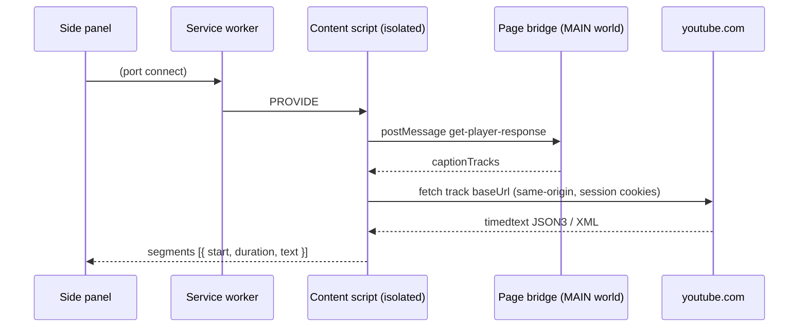

# IU Language Companion

A Chinese and Japanese dictionary for video. It reads the subtitles of the video
you are watching and shows them as a transcript you can look words up in.

YouTube, or a video file on your own computer. Chrome, Edge, Brave and Firefox.
Free, open source, no account.

> **IU**, *I* and *you*. 友 means **friend** in Hokkien (*iú*), Mandarin (*yǒu*)
> and Japanese (*tomo*).

## Status

**Not published yet.** The extension works and is being prepared for the **Chrome
Web Store** and **Firefox Add-ons (AMO)**. One build serves both: the manifest
declares each browser's keys and each ignores the other's.

Until it is listed, install it from the source below.
[`CHROMEWEBSTORE.md`](CHROMEWEBSTORE.md) holds the store listing copy, permission
justifications and privacy disclosure.

## Install from source

Load the folder in either browser, from a clean copy of the source, not a working
tree with `node_modules/` and `docs/` in it.

**Chrome / Edge / Brave** (116+):

1. `chrome://extensions` → enable **Developer mode**.
2. **Load unpacked** → select the folder.
3. Open a video, then click the toolbar icon to open the side panel.

**Firefox** (128+):

1. `about:debugging#/runtime/this-firefox` → **Load Temporary Add-on**.
2. Select `manifest.json` in that folder.
3. Open a video, then click the toolbar icon, the panel opens as a sidebar.

Firefox removes temporary add-ons when it closes; a permanent install needs the
signed build from AMO.

YouTube tabs that are **already open** work in both, the content scripts are
injected on demand, so there is nothing to reload.

## What it does

- **Marks the words you don't know.** Choose HSK for Chinese or JLPT for Japanese
  and the level you are working at. Words at or above it are underlined in a colour
  for their level; words you know are left plain.
- **Defines any word on hover.** Reading and meaning. Chinese shows pinyin,
  Japanese shows kana. A word shows every list that places it, HSK 2.0 and HSK 3.0
  frequently disagree, and both are shown.
- **Shows two subtitle tracks at once.** The language you are learning with a
  second line beneath it. Either line can be a machine translation where the video
  offers one; translated lines are tagged so they are not mistaken for a real
  track.
- **Follows playback.** The current line is highlighted and the list scrolls with
  it. Clicking a line seeks the video to that moment.
- **Exports** the transcript as plain text or an SRT subtitle file.

## How it works

The **service worker owns the transcript table**; the panel is a subscriber that
renders what it is sent; content scripts are stateless fetch providers. That split
is what makes tab switching instant, and it is why transcripts survive a panel
being closed.

Caption tracks are not in the DOM, they live in the page's own JS as
`ytInitialPlayerResponse`. An isolated-world content script cannot read that, so a
tiny MAIN-world bridge hands it over:



Captions are fetched by the content script with the page's own session. The
internal player API is the fallback when a direct fetch is refused.

All site-specific knowledge, the player response shape, the two timedtext
formats, track selection, seeking, is confined to
`src/content/youtube-content.js`. Everything above it deals in
`{ start, duration, text }`, so a second provider is a content script plus a
registry entry.

```
manifest.json
src/
  common/        messages, transcript formatting/alignment, settings, errors
  content/       page-bridge.js (MAIN world) + youtube-content.js (fetch/parse/seek)
  background/    service worker: transcript table, tab tracking, marking
  learn/         word lists, dictionaries, segmenter  (imports nothing)
  sidepanel/     renders state, sends intents
  viewer/        local video source: player page, MKV parser, subtitles, audio
  offscreen/     PARKED: owns the MediaStream + engine
  engines/       PARKED: recogniser adapter + registry
  vendor/        mediabunny.js, generated, MPL-2.0 (see THIRD-PARTY.md)
```

`src/learn/` deliberately imports nothing and touches no `chrome` API, so it can
be reused outside an extension. Both content scripts are injected as **classic**
scripts and cannot `import`, so they repeat the message names and the
`findActiveIndex` helper that also live in `src/common/`. Both places say so.

## Word lists and languages

Chinese and Japanese work. **Korean is planned.**

Levels are data, not code: each list declares its own levels, names and language,
so adding a list is a data change, and adding a language is a dictionary plus a
row in the generated index.

Both dictionaries are bundled and parsed on demand. Nothing is fetched from a
server we run.

## Development

```bash
npm test               # hermetic suites, no browser, no network
npm run test:browser   # real Chromium, fixture pages
npm run ui             # Vite preview of the side panel, for layout work
```

There are no runtime dependencies and no build step: the repository is the
extension. The one generated file, `src/vendor/mediabunny.js`, is committed, so
nothing has to be installed to load or package it. Rebuild it with
`node tools/build-vendor.mjs` if its version changes.

### Building the store package

```bash
make release           # stage, lint, zip, verify -> build/iu-language-companion-<version>.zip
```

One ZIP serves both stores: the manifest carries each browser's keys and each
ignores the other's, so there is nothing to build differently for Chrome and
Firefox. `make help` lists the individual steps (`stage`, `lint`, `zip`, `verify`).

The list of what ships lives in the Makefile, and `make verify` asserts the
archive contains exactly that.

[`TESTING.md`](TESTING.md) covers the tiers, what each suite does and does not
cover, the panel preview in detail, and where the fixtures come from.
[`CHROMEWEBSTORE.md`](CHROMEWEBSTORE.md) holds the listing copy, permission
justifications and privacy disclosure for both stores.

### Cross-browser

One manifest serves Chrome and Firefox. `background` declares both `service_worker`
(Chrome) and `scripts` (Firefox); `side_panel` and `sidebar_action` are declared
side by side, and each browser ignores the key it does not know. Code reads
`globalThis.browser ?? globalThis.chrome` at each use site, so no bundler or
polyfill is involved.

The one genuinely browser-specific call is opening the panel: Chrome's
`sidePanel.open` and Firefox's `sidebarAction.toggle` are incompatible, and that
handler feature-detects. Everything else is identical.

Adding a third target means checking `world: "MAIN"` support and the sidebar API
for that browser; the rest is the same source.

## AI use

This project is developed with AI coding assistance, and we support that use
where it respects privacy and serves the common good. That is part of why this
extension collects nothing, has no server and no account, and why the source is
open under MIT.

The bar does not move for AI-assisted work: every claim in these documents is
checked by a test against the shipped source, and a human reviews before merge.
See [`AI-USE.md`](AI-USE.md).

Agents working in this repository should read [`AGENTS.md`](AGENTS.md).

## Permissions

| Permission         | Why                                                     |
| ------------------ | ------------------------------------------------------- |
| `sidePanel`        | Render the transcript UI.                                |
| `storage`          | Remember your language and level choices.                |
| `scripting`        | Inject the content scripts on demand.                    |
| `webNavigation`    | Track which video the tab is on.                         |
| `contextMenus`     | Put **Open video files…** on the extension's own toolbar menu. Adds nothing to the page right-click menu, and grants no access to any page. |
| `host_permissions` | `https://*.youtube.com/*`, read captions from the page. |

The list is pinned by a test. There is no `activeTab`, no `tabs`, and no
`web_accessible_resources`, so no page can reach into the extension.

## Privacy

Nothing is collected.

- **No account, no server of ours, no analytics, no telemetry, no crash
  reporting.**
- **Settings are stored in your browser**, in `chrome.storage.local`, and are not
  synced anywhere, not even to your own other devices.
- **No browsing history and no identifiers**, and no tab contents beyond the
  caption data below.
- **One external host: `youtube.com`.** The extension reads the caption track of
  the video in the tab you have open, using that page's own session. The
  dictionaries are bundled, so looking a word up makes no request at all.

The caption fetch is the only request the extension makes outside itself, and a
test fails the build if another host or transport appears. See
[`TESTING.md`](TESTING.md#the-privacy-claim-is-a-check-not-a-paragraph).

## Known limitations

- **Marking is Chinese and Japanese only.** Korean needs segmenter support (below)
  and spaced scripts like English cannot be marked at all, since a sentence is one
  token to a word-list matcher.
- **Inflected Japanese forms mark the dictionary headword, not the word on
  screen.** `食べました` does not match `食べる`. Kanji forms mark correctly.
- **A few Japanese words share one entry where JMdict splits homographs** (`私` is
  both わたし and あたし), so hover shows one reading. 156 spellings are affected.
- **Bilingual alignment is approximate.** Cues are matched by start time; a pair
  more than 1.5s apart is left blank.
- **Videos without captions show an error** rather than a fallback.
- **Live streams** have unstable caption timing, so seeking may not line up.
- **Transcripts are not persisted** past a browser restart. The 6 most recent
  videos are cached.

## Roadmap

| Order | Work | What it involves |
| ----- | ---- | ---------------- |
| 1 | Save words, and export to Anki | Per-word known and unknown state, saving a word as you meet it, and one click from a line to a card |
| 2 | Korean | Segmenter support for Hangul, a Korean dictionary, a TOPIK list, and inflection handling |
| 3 | Netflix, Disney+ | A reader for each service, since neither exposes subtitles the way YouTube does |
| 4 | Ebooks, webpages | The same treatment as the streaming services |

Not planned: accounts, cross-device sync, a paid tier, mobile apps.

## Parked: audio capture

A tab-capture path exists, capturing tab audio and running a speech recogniser,
but it is behind `USE_AUDIO_CAPTURE = false` and has never been run end to end.

> ⚠️ **Turning it on also means restoring two manifest permissions.** `tabCapture`
> and `offscreen` were **removed** while the path is unreachable, because a
> permission no shipping feature uses cannot be honestly justified to a store
> reviewer. Add both back to `permissions` in `manifest.json` before setting the
> flag, or `getMediaStreamId` and `createDocument` fail with the API undefined.

The engine is a stub that emits placeholder events, so the parked path is a
pipeline test and not a transcriber.

## Licence

Our code, everything in `src/` except `src/vendor/`, plus the icons and the tests,
is **MIT**; see [`LICENSE`](LICENSE). One third-party file ships:
`src/vendor/mediabunny.js` (MPL-2.0), a generated bundle that reads a local video's
audio tracks. MPL-2.0 is file-level copyleft: it obliges publishing changes to its
own files, and imposes nothing on this project. No third-party fonts or images are
bundled.

The dictionaries are **not** ours and **not** MIT. Both are CC BY-SA 4.0 derived
works:

- `src/learn/data/chinese.json`, CC-CEDICT, with HSK levels from the official MOE
  HSK 3.0 word list;
- `src/learn/data/japanese.json`, JMdict (EDRDG), with JLPT levels from an
  MIT-licensed list.

Full attribution, source revisions and content hashes are in
[`THIRD-PARTY.md`](THIRD-PARTY.md).
