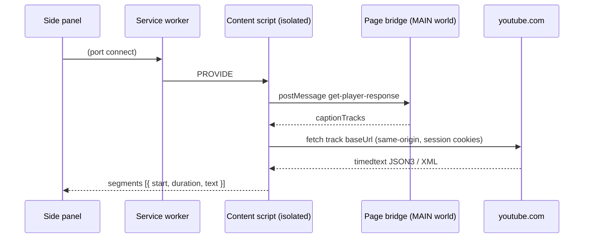

# IU

A browser extension that turns a video's captions into a readable, studyable text.

Open a video and the side panel shows its subtitles as text you can actually work
with. Words above your level are marked, with a colour for how hard they are;
hovering any word gives its reading and meaning. Click a line to jump the video to
that moment. Two subtitle tracks can be shown at once, and videos you have visited
stay cached so switching back is instant.

Learning **Chinese** (HSK) and **Japanese** (JLPT), from **YouTube**. The video
source sits behind a provider seam, so another site is a data addition rather than
a rewrite.

> **IU** — *I* and *you*, the two of us.
> 友 is *iú* in Hokkien, *yǒu* in Mandarin, *tomo* in Japanese — and it means
> **friend** in all three. A companion to read beside you.

## Status

**Not published yet.** The extension works and is being prepared for the **Chrome
Web Store** and **Firefox Add-ons (AMO)**. One build serves both: the manifest
declares each browser's keys and each ignores the other's.

Until it is listed, install it from the source below. Store listing preparation —
permission justifications, privacy disclosure, screenshots — lives in
[`CHROMEWEBSTORE.md`](CHROMEWEBSTORE.md).

## Install from source

For either browser, the folder you load is the repository root.

> **Load a clean copy, not your working tree.** The repository root contains
> `node_modules/` (≈52 MB), `docs/` (local notes, including an 8.9 MB conversation
> log) and `test/fixtures/`. None of that belongs in an extension: it inflates what
> the browser loads, and a store scanner reads large unfamiliar JSON as third-party
> code. Clone into a scratch directory, or use the same file set the store package
> uses — everything except `test/`, `tools/`, `docs/`, `node_modules/` and the
> dotfiles.

**Chrome / Edge / Brave** (116+):

1. `chrome://extensions` → enable **Developer mode**.
2. **Load unpacked** → select the folder.
3. Open a video, then click the toolbar icon to open the side panel.

**Firefox** (128+):

1. `about:debugging#/runtime/this-firefox` → **Load Temporary Add-on**.
2. Select `manifest.json` in that folder.
3. Open a video, then click the toolbar icon — the panel opens as a sidebar.

Firefox removes temporary add-ons when it closes; a permanent install needs the
signed build from AMO.

YouTube tabs that are **already open** work in both — the content scripts are
injected on demand, so there is nothing to reload.

## What it does

- **Marks words above your level.** Pick a word list — HSK for Chinese, JLPT for
  Japanese — and the level to mark from. Words at or above it are underlined in
  their level's colour; words you already know stay quiet.
- **Defines any word on hover.** Reading and meaning, with the level from every
  list that places it. Words outside the graded lists are still defined.
- **Reads two tracks at once.** The language you are learning, with a second line
  beneath it. Either line can be machine translated where the video offers it, and
  a translated line is labelled so it is never mistaken for a real subtitle.
- **Follows playback.** The spoken line highlights and scrolls; clicking one seeks
  the video there.
- **Exports** to `.txt` or `.srt`.

## How it works

The **service worker owns the transcript table**; the panel is a subscriber that
renders what it is sent; content scripts are stateless fetch providers. That split
is what makes tab switching instant, and it is why transcripts survive a panel
being closed.

Caption tracks are not in the DOM — they live in the page's own JS as
`ytInitialPlayerResponse`. An isolated-world content script cannot read that, so a
tiny MAIN-world bridge hands it over:



Captions are fetched by the content script with the page's own session. The
internal player API is the fallback when a direct fetch is refused.

All site-specific knowledge — the player response shape, the two timedtext
formats, track selection, seeking — is confined to
`src/content/youtube-content.js`. Everything above it deals in
`{ start, duration, text }`, so a second provider is a content script plus a
registry entry.

```
manifest.json
src/
  common/        messages, transcript formatting/alignment, settings, errors
  content/       page-bridge.js (MAIN world) + youtube-content.js (fetch/parse/seek)
  background/    service worker: transcript table, tab tracking, marking
  learn/         word lists, dictionaries, segmenter  (imports nothing)
  sidepanel/     renders state, sends intents
  offscreen/     PARKED: owns the MediaStream + engine
  engines/       PARKED: recogniser adapter + registry
```

`src/learn/` deliberately imports nothing and touches no `chrome` API, so it can
be reused outside an extension. Both content scripts are injected as **classic**
scripts and cannot `import`, so they repeat the message names and the
`findActiveIndex` helper that also live in `src/common/`. Both places say so.

## Word lists and languages

Levels are data, not code. Each list declares its own levels, names and language,
and nothing in the extension knows what HSK or JLPT is — so adding a list is a
data change, and adding a *language* is a dictionary plus a row in the generated
index.

Both dictionaries are bundled and parsed on demand. Nothing is fetched from a
server we run.

## Development

```bash
npm test               # hermetic suites, no browser, no network
npm run test:browser   # real Chromium, fixture pages
npm run ui             # Vite preview of the side panel, for layout work
```

There are no runtime dependencies, and nothing is built — the repository is the
extension.

[`TESTING.md`](TESTING.md) covers the tiers, what each suite does and does not
cover, the panel preview in detail, and where the fixtures come from.
[`CHROMEWEBSTORE.md`](CHROMEWEBSTORE.md) holds the listing copy, permission
justifications and privacy disclosure for both stores.

### Cross-browser

One manifest serves Chrome and Firefox. `background` declares both `service_worker`
(Chrome) and `scripts` (Firefox); `side_panel` and `sidebar_action` are declared
side by side, and each browser ignores the key it does not know. Code reads
`globalThis.browser ?? globalThis.chrome` at each use site, so no bundler or
polyfill is involved.

The one genuinely browser-specific call is opening the panel: Chrome's
`sidePanel.open` and Firefox's `sidebarAction.toggle` are incompatible, and that
handler feature-detects. Everything else is identical.

Adding a third target means checking `world: "MAIN"` support and the sidebar API
for that browser; the rest is the same source.

## Permissions

| Permission         | Why                                                     |
| ------------------ | ------------------------------------------------------- |
| `sidePanel`        | Render the transcript UI.                                |
| `storage`          | Remember your language and level choices.                |
| `scripting`        | Inject the content scripts on demand.                    |
| `webNavigation`    | Track which video the tab is on.                         |
| `host_permissions` | `https://*.youtube.com/*` — read captions from the page. |

Nothing else is requested. The extension makes no request to any server of ours,
collects no analytics, and has no account.

## Known limitations

- **Marking covers Chinese and Japanese — kanji *and* kana — but not spaced
  scripts.** Korean and English/Spanish cannot be marked: an English sentence is a
  single token to a word-list matcher.
- **Inflected Japanese forms mark the dictionary headword, not the word on
  screen.** `食べました` does not match `食べる`; where the stem is itself a
  headword it marks that, carrying a narrower scope. Kanji forms mark correctly.
- **A few Japanese words share one entry where JMdict splits homographs** (`私` is
  both わたし and あたし). 156 spellings are affected, so hover shows one reading.
- **Bilingual alignment is approximate** — cues are matched by start time, and a
  pair more than 1.5s apart is left blank rather than mismatched.
- **Videos without captions show an error**, not a fallback. Auto-generated tracks
  cover most, but not all.
- **Live streams** have unstable caption timing; seeking may not line up.
- **Transcripts are not persisted** — they survive tab switches and a closed panel,
  but not a browser restart. The 6 most recent videos are cached.

## Parked: audio capture

A tab-capture path exists — capturing tab audio and running a speech recogniser —
but it is behind `USE_AUDIO_CAPTURE = false` and has never been run end to end.

> ⚠️ **Turning it on also means restoring two manifest permissions.** `tabCapture`
> and `offscreen` were **removed** while the path is unreachable, because a
> permission no shipping feature uses cannot be honestly justified to a store
> reviewer. Add both back to `permissions` in `manifest.json` before setting the
> flag, or `getMediaStreamId` and `createDocument` fail with the API undefined.

The engine is a stub that emits placeholder events, so the parked path is a
pipeline test and not a transcriber.

## Licence

Our code — everything in `src/`, the icons, the tests — is **MIT**; see
[`LICENSE`](LICENSE). No third-party code, fonts or images are bundled.

The dictionaries are **not** ours and **not** MIT. Both are CC BY-SA 4.0 derived
works:

- `src/learn/data/chinese.json` — CC-CEDICT, with HSK levels from the official MOE
  HSK 3.0 word list;
- `src/learn/data/japanese.json` — JMdict (EDRDG), with JLPT levels from an
  MIT-licensed list.

Full attribution, source revisions and content hashes are in
[`THIRD-PARTY.md`](THIRD-PARTY.md).
