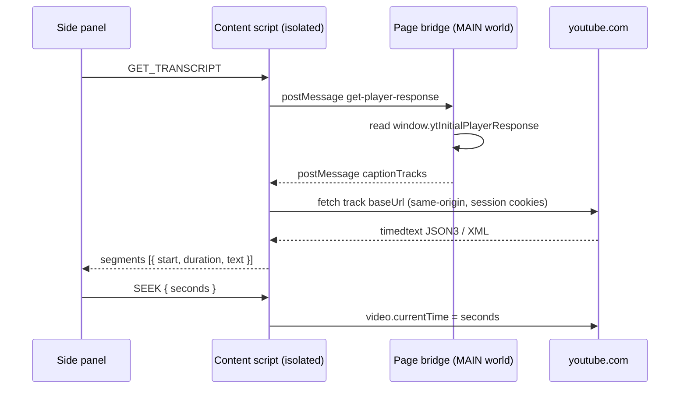
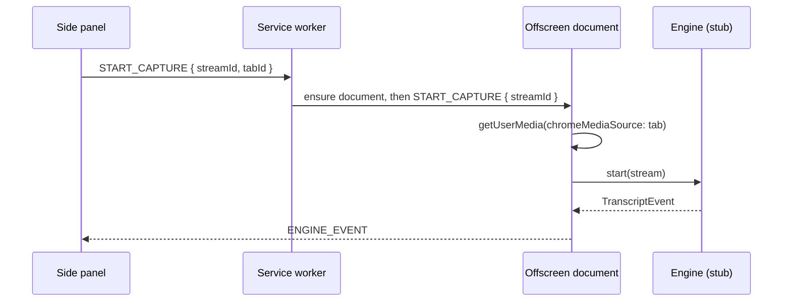

# Transcribe (Chrome extension)

Personal-use Chrome extension that shows a **YouTube video's transcript in the
side panel**, where clicking a line seeks the video to that moment.

Status: **captions phase**. The panel reads YouTube's own caption tracks — no
audio capture is involved. The tab-capture + speech-recognition path is built
but parked behind a flag (see [Parked: audio capture](#parked-audio-capture)).

## Load it

1. `chrome://extensions` → enable **Developer mode**.
2. **Load unpacked** → select this folder.
3. Open (or reload) a **YouTube watch page** — the content scripts only run on
   pages loaded after the extension is installed.
4. Click the extension icon to open the side panel.

No build step: Chrome loads `src/**` as-is. Requires Chrome 116+ (side panel
plus `world: MAIN` content scripts).

### What to check

- The panel loads the transcript **automatically** if a YouTube tab is open.
- Status line reads `N lines · <video title>`.
- Clicking any line jumps the video to that timestamp.
- The line being spoken highlights as the video plays, and the list scrolls
  with it. **Follow** toggles that scrolling.
- The dropdown lists every caption track; picking one reloads from it.
- Codecs show `(auto)` for machine-generated tracks.


## How captions are read

The caption tracks for the video you are watching live on the page's `window`
as `ytInitialPlayerResponse`. An isolated-world content script shares the DOM
but **not** the page's JS globals, so it cannot read that. A tiny MAIN-world
script bridges the gap.



Captions are **not** in the DOM, and the `baseUrl` embedded in the page can no
longer be fetched by server-side callers — jdepoix/youtube-transcript-api
documents that, and works around it by re-asking the internal player API
(INNERTUBE). We run inside the user's own tab, so a plain same-origin fetch is
tried first; the INNERTUBE request is the fallback.

### Capability probe

The panel holds just four calls, so all page/bridge protocol details stay in
one file. If captions fail to load, the status line reports which stage failed.
Everything page-specific — the player response shape, the timedtext formats
(JSON3 and XML), track selection, seeking — is confined to
`src/content/youtube-content.js`.

## Parked: audio capture

The tab-capture pipeline is still wired and tested, gated by `USE_AUDIO_CAPTURE`
in `src/sidepanel/sidepanel.js`.

A service worker cannot hold a `MediaStream`, so an **offscreen document** owns
the stream and hosts the recognition engine:



The three contexts never call each other directly — every message carries an
explicit `target` and listeners ignore anything not addressed to them. The
contract lives in one place: `src/common/messages.js`.

```
manifest.json
src/
  common/
    messages.js                # message names + routing targets
    transcript.js              # timestamp/SRT formatting (ES module, pages only)
  content/
    page-bridge.js             # MAIN world: reads window.ytInitialPlayerResponse
    youtube-content.js         # isolated: fetch + parse captions, seek, report position
  background/service-worker.js # PARKED: stream id, offscreen lifecycle
  offscreen/                   # PARKED: owns the MediaStream + engine
  engines/
    engine.js                  # adapter interface + registry  <-- change point
    stub-engine.js             # placeholder recogniser
  sidepanel/
    sidepanel.html/js/css      # transcript list, click-to-seek, follow, export
    audio-capture.js           # PARKED: the panel's half of the capture path
```

Content scripts are injected as **classic** scripts and cannot use `import`, so
`youtube-content.js` repeats the message names and the `findActiveIndex` helper
that also live in `src/common/`. Both places carry a comment saying so.

## Permissions

| Permission         | Why                                                        |
| ------------------ | ---------------------------------------------------------- |
| `sidePanel`        | Render the transcript UI.                                  |
| `storage`          | Reserved for persisting settings/transcripts.              |
| `host_permissions` | `https://*.youtube.com/*` — read captions from the page.   |
| `tabCapture`       | PARKED — read the current tab's audio.                     |
| `offscreen`        | PARKED — host the `MediaStream` + engine in a DOM context. |

## Known limitations

- **YouTube only.** Captions come from `ytInitialPlayerResponse`, which only
  that site provides. This is deliberate for now.
- **Videos without captions show an error**, not a fallback. Auto-generated
  tracks cover most videos, but not all.
- **Live streams** have captions with unstable timing; seeking may not line up.
- **The transcript is lost when the panel closes** — nothing is persisted yet.
- **The stub engine transcribes nothing.** It emits placeholders.
- **PARKED path is unverified in a browser.** The tab-capture flow is compiled
  and reviewed but has never been run end to end; the stream-id call in
  particular may need to move into the service worker.

## Roadmap

- [ ] Verify the parked capture path, find or write a real engine.
- [ ] Persist transcripts via `chrome.storage`.
- [ ] Export formats beyond `.txt` / `.srt` (VTT, JSON).
- [ ] Search within the transcript.
- [ ] Optional in-page subtitle overlay.
