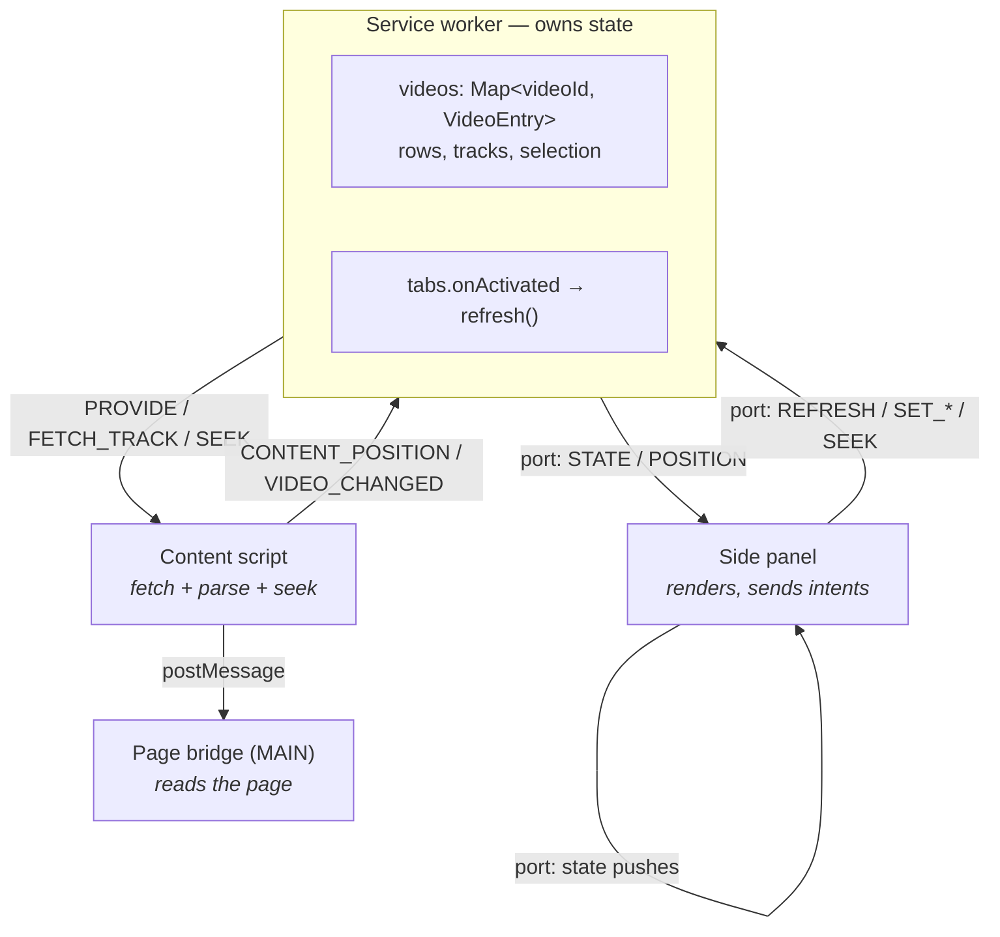
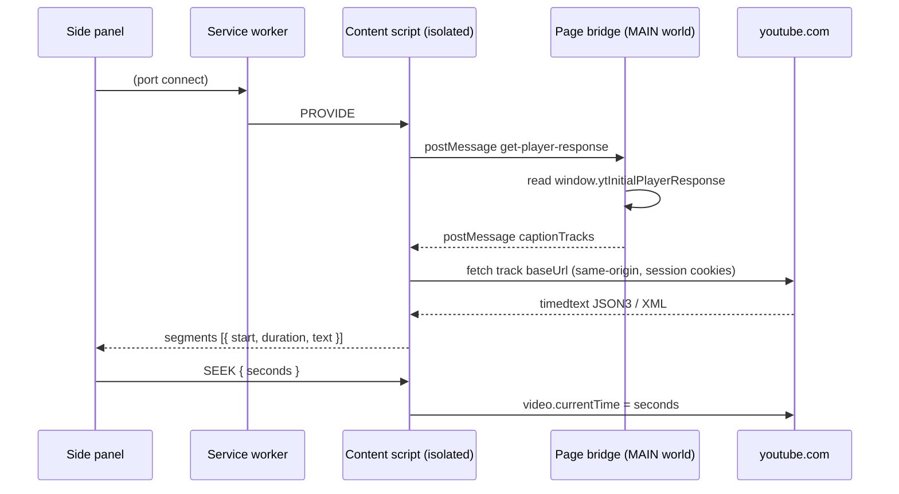
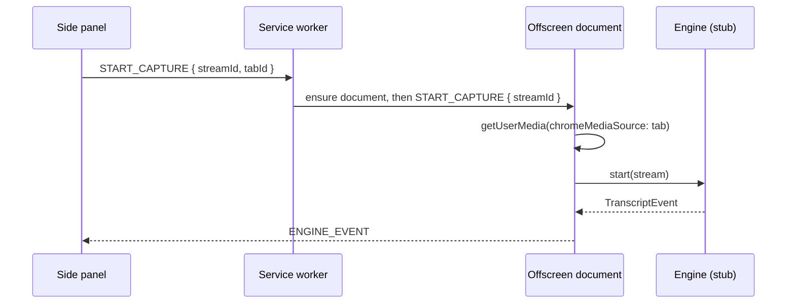

# IU

Personal-use Chrome extension for learning a language by watching video. It
shows a **YouTube video's captions in the side panel**, where clicking a line
seeks the video to that moment. Two caption tracks can be shown at once
(bilingual), and every video you visit stays cached so switching back is
instant.

> **IU** — *I* and *you*, the two of us.
> 友 is *iú* in Hokkien, *yǒu* in Mandarin, *tomo* in Japanese — and it means
> **friend** in all three. A companion to read beside you.

Status: **captions phase**. The panel reads YouTube's own caption tracks — no
audio capture is involved. The tab-capture + speech-recognition path is built
but parked behind a flag (see [Parked: audio capture](#parked-audio-capture)).

## Load it

1. `chrome://extensions` → enable **Developer mode**.
2. **Load unpacked** → select this folder.
3. Click the extension icon to open the side panel.

No reloading of YouTube tabs is needed: the worker injects the content scripts
on demand, so **tabs that were already open work too**. Requires Chrome 116+
(side panel, `world: MAIN` content scripts).

## Tests

```bash
npm test           # everything
npm run test:unit  # pure logic, no stubs
npm run test:sw    # service worker
npm run test:panel # side panel
```

No dependencies — plain Node scripts, so `npm test` works with nothing installed.

Each suite boots a real module against stubbed browser globals and drives it
through its message surface, rather than testing extracted functions. That is
deliberate: every bug found so far has been in the wiring, not the logic, and
none were visible to a linter. A panel that called `chrome.runtime.connect` once
and had no recovery path looked completely reasonable and hung forever.

| Suite | Boots | Covers |
| --- | --- | --- |
| `unit.test.mjs` | nothing | formatting, active-cue lookup, alignment |
| `service-worker.test.mjs` | worker + `chrome` stub | routing, caching, injections |
| `sidepanel.test.mjs` | panel + DOM stub | rendering, reconnect, intents |
| `page-bridge.test.mjs` | bridge + page stub | the MAIN-world protocol |
| `content.test.mjs` | content script | JSON3/XML parsing, INNERTUBE fallback |

Suites run in separate processes because they share globals (`chrome`,
`document`) and the module cache; one process would let a suite's stubs leak into
another's.

### What the tests do not cover

Nothing here runs a real browser. Whether `chrome.scripting` reaches a tab whose
page loaded before the extension, whether YouTube serves the caption `baseUrl` to
a same-origin fetch, and whether two real caption tracks align well are all still
open — they need a browser, and the answers come from the status line.

### What to check

- The panel resolves whatever YouTube video is in the active tab, automatically.
- Status line reads `N lines · <lang> · <video title>`.
- Clicking a line jumps the video to that timestamp.
- The spoken line highlights as it plays; the list scrolls with it. **Follow**
  toggles that scrolling.
- Pick a second language in the right-hand dropdown to get two subtitles at
  once. The &#8646; button swaps the two.
- Switching to another tab and back does **not** re-fetch — the transcript is
  cached, and the panel swaps immediately.
- The second-language choice is remembered across restarts.

## Architecture

The **service worker owns the transcript table**. The panel is a subscriber that
renders whatever it is sent; content scripts are stateless fetch providers.

That split is what makes tab switching seamless. A panel document is destroyed
when it closes or its tab closes, taking a panel-side cache with it. The worker
is not, and the panel's open port keeps it alive, so everything you visit stays
cached:



Two channels, deliberately: the **panel** talks over a long-lived port (which
also keeps the worker alive), while **content scripts** use
`chrome.runtime.sendMessage`. They are separate channels, so a port message
never reaches `onMessage` and vice versa — that is why panel intents are handled
in `handlePanelMessage` and content reports in the `onMessage` switch.

## How captions are read

The caption tracks for the video you are watching live on the page's `window`
as `ytInitialPlayerResponse`. An isolated-world content script shares the DOM
but **not** the page's JS globals, so it cannot read that. A tiny MAIN-world
script bridges the gap.



Captions are **not** in the DOM, and the `baseUrl` embedded in the page can no
longer be fetched by server-side callers — jdepoix/youtube-transcript-api
documents that, and works around it by re-asking the internal player API
(INNERTUBE). We run inside the user's own tab, so a plain same-origin fetch is
tried first; the INNERTUBE request is the fallback.

### Where the coupling is

All page-specific knowledge — the player response shape, the timedtext formats
(JSON3 and XML), track selection, seeking — is confined to
`src/content/youtube-content.js`. Everything above it deals in
`{ start, duration, text }`. If YouTube changes something, that is the one file
to look at, and the status line names which stage failed.

## Bilingual subtitles

A second track can be shown under each line. The two tracks are separate
downloads with independent cue boundaries and no ids linking them, so
`alignSecondary` in `src/common/transcript.js` walks both lists once matching
each primary cue to the nearest secondary cue by start time. A pair further
apart than 1.5s is left unmatched rather than paired — without that threshold a
few seconds of drift would put a plausible-looking wrong translation on every
line.

Alignment is approximate by design: it depends on the two tracks describing the
same speech in roughly the same place. It is verified by unit-style checks run
outside the browser (identical timings, differing granularity, drift inside and
outside tolerance, empty tracks).

## Parked: audio capture

The tab-capture pipeline is still wired and tested, gated by `USE_AUDIO_CAPTURE`
in `src/sidepanel/sidepanel.js`.

A service worker cannot hold a `MediaStream`, so an **offscreen document** owns
the stream and hosts the recognition engine:



Every message carries an explicit `target` and listeners ignore anything not
addressed to them. The contract lives in one place: `src/common/messages.js`.

```
manifest.json
src/
  common/
    messages.js                # message names + routing targets
    transcript.js              # formatting, active-segment lookup, dual-track alignment
  content/
    page-bridge.js             # MAIN world: reads window.ytInitialPlayerResponse
    youtube-content.js         # isolated: fetch + parse captions, seek, report position
  background/service-worker.js # owns the transcript table + tab tracking
  offscreen/                   # PARKED: owns the MediaStream + engine
  engines/
    engine.js                  # adapter interface + registry  <-- change point
    stub-engine.js             # placeholder recogniser
  sidepanel/
    sidepanel.html/js/css      # renders state, sends intents
    audio-capture.js           # PARKED: the panel's half of the capture path
```

Content scripts are injected as **classic** scripts and cannot use `import`, so
`youtube-content.js` repeats the message names and the `findActiveIndex` helper
that also live in `src/common/`. Both places carry a comment saying so.

Both content scripts also carry a **re-entry guard** (`window.__iu*`
flags). The worker injects them with `chrome.scripting` on every request, so
without the guard each injection would add another set of listeners and answers
would arrive twice.

## Permissions

| Permission         | Why                                                        |
| ------------------ | ---------------------------------------------------------- |
| `sidePanel`        | Render the transcript UI.                                  |
| `storage`          | Remember the chosen second language.                       |
| `scripting`        | Inject the content scripts on demand.                      |
| `webNavigation`    | Find which frame holds the video.                          |
| `host_permissions` | `https://*.youtube.com/*` — read captions from the page.   |
| `tabCapture`       | PARKED — read the current tab's audio.                     |
| `offscreen`        | PARKED — host the `MediaStream` + engine in a DOM context. |

## Known limitations

- **YouTube only.** Captions come from `ytInitialPlayerResponse`, which only
  that site provides. This is deliberate for now.
- **Videos without captions show an error**, not a fallback. Auto-generated
  tracks cover most videos, but not all.
- **Live streams** have captions with unstable timing; seeking may not line up.
- **Bilingual alignment is approximate.** It matches cues by start time, never
  reusing a cue and leaving anything more than 1.5s apart blank. A track that
  is genuinely offset will show blanks rather than wrong pairings.
- **Transcripts are not persisted.** They live in the worker, so they survive
  tab switches and panel closes, but not a worker restart or browser restart.
- **The cache holds the 6 most recent videos**, and the one on screen is never
  evicted.
- **The stub engine transcribes nothing.** It emits placeholders.
- **PARKED path is unverified in a browser.** The tab-capture flow is compiled
  and reviewed but has never been run end to end; the stream-id call in
  particular may need to move into the service worker.

## Roadmap

- [ ] Verify the parked capture path, find or write a real engine.
- [ ] Persist transcripts across restarts via `chrome.storage`.
- [ ] Export formats beyond `.txt` / `.srt` (VTT, JSON).
- [ ] Search within the transcript.
- [ ] Improve the UI (currently functional, not pretty).
- [ ] Optional in-page subtitle overlay.
