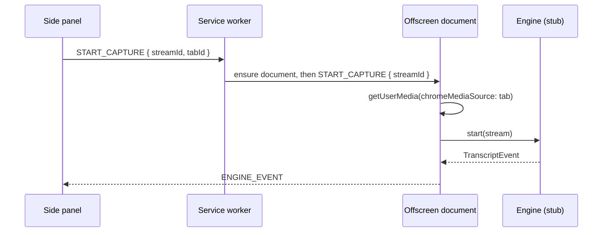

# Transcribe (Chrome extension)

Personal-use Chrome extension that transcribes the **current tab's audio** and
shows a live transcript in the **side panel**.

Status: **scaffold**. The capture pipeline is wired end to end; the actual
speech recognition engine is a deliberate stub (see [Engines](#engines)).

## Load it

1. `chrome://extensions` → enable **Developer mode**.
2. **Load unpacked** → select this folder.
3. Pin the extension, click its icon to open the side panel.
4. Open a tab with audio, click **Start**.

No build step: Chrome loads `src/**` as-is. Requires Chrome 116+ (offscreen
documents + `sidePanel.open`).

## How it works

A service worker cannot hold a `MediaStream`, and only a service worker may mint
a tab-capture stream id. An **offscreen document** bridges that gap: it owns the
stream and hosts the engine.



The three contexts never call each other directly — every message carries an
explicit `target` and listeners ignore anything not addressed to them. The
contract lives in one place: `src/common/messages.js`.

```
manifest.json
src/
  common/messages.js          # message names + routing targets
  background/service-worker.js# stream id ($1), offscreen lifecycle, tab teardown
  offscreen/                  # owns the MediaStream + engine, restores tab audio
  engines/
    engine.js                 # adapter interface + registry  <-- change point
    stub-engine.js            # placeholder recogniser
  sidepanel/                  # Start/Stop, live view, copy/clear/save
```

## Engines

Everything downstream of the engine is agnostic to *how* speech becomes text.
An engine is any object implementing `start(stream)`, `stop()` and `onEvent(fn)`
emitting `{ kind: 'partial' | 'final', text, … }` — the full contract is
documented in `src/engines/engine.js`.

To add one:

```js
// src/engines/engine.js
import { WhisperEngine } from './whisper-engine.js';
registerEngine('whisper', () => new WhisperEngine());
```

then set `ENGINE_NAME` in `src/offscreen/offscreen.js`. The shipped `stub`
engine emits fake partial/final pairs on a timer so the whole pipeline can be
exercised before a recogniser is chosen.

## Permissions

| Permission    | Why                                                        |
| ------------- | ---------------------------------------------------------- |
| `tabCapture`  | Read the current tab's audio.                              |
| `offscreen`   | Host the `MediaStream` + engine in a DOM context.          |
| `sidePanel`   | Render the transcript UI.                                  |
| `storage`     | Reserved for persisting settings/transcripts.              |

No host permissions, no content scripts — the extension touches one tab at a
time and nothing else.

## Known limitations

- **One tab at a time.** `chrome.tabCapture` cannot capture two tabs in one
  profile simultaneously. Clicking **Start** stops any capture already running.
- **Capturing reroutes the tab's audio.** The offscreen document plays it back
  so you can still hear it; **Hear tab** mutes that monitor only.
- **The stub engine transcribes nothing.** It emits placeholders.

## Roadmap

- [ ] Choose and implement the real engine (see `src/engines/`).
- [ ] Persist transcripts via `chrome.storage`.
- [ ] Export formats beyond `.txt` (SRT/VTT).
- [ ] Optional in-page subtitle overlay.
